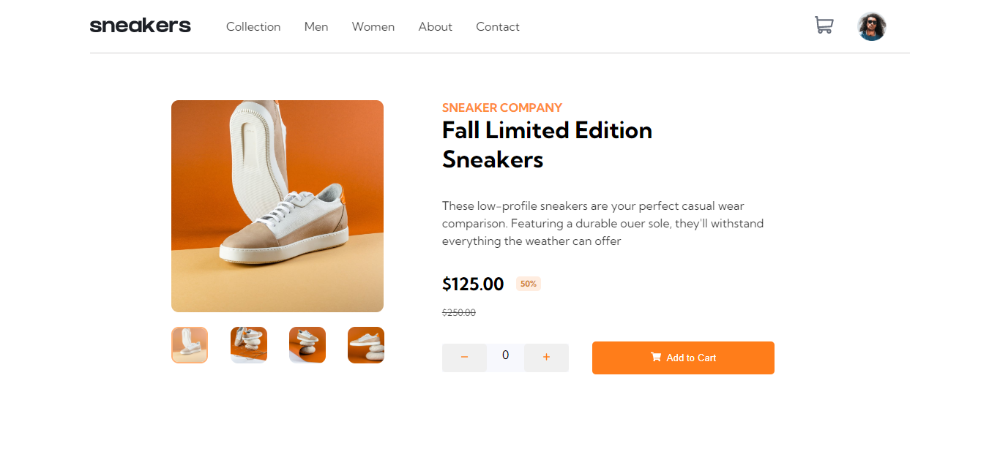

# Frontend Mentor - E-commerce product page solution

This is a solution to the [E-commerce product page challenge on Frontend Mentor](https://www.frontendmentor.io/challenges/ecommerce-product-page-UPsZ9MJp6). Frontend Mentor challenges help you improve your coding skills by building realistic projects.

## Table of contents

- [Overview](#overview)
  - [The challenge](#the-challenge)
  - [Screenshot](#screenshot)
  - [Links](#links)
- [My process](#my-process)
  - [Built with](#built-with)
  - [Useful resources](#useful-resources)
- [Author](#author)

## Overview

### The challenge

Users should be able to:

- View the optimal layout for the site depending on their device's screen size
- See hover states for all interactive elements on the page
- Open a lightbox gallery by clicking on the large product image
- Switch the large product image by clicking on the small thumbnail images
- Add items to the cart
- View the cart and remove items from it

### Screenshot

### Links

- Solution URL: [https://www.frontendmentor.io/solutions/ecommerce-product-page-rktZh2CEc](https://www.frontendmentor.io/solutions/ecommerce-product-page-rktZh2CEc)
- Live Site URL: [https://gillette-ecommerce-product-page.netlify.app/](https://gillette-ecommerce-product-page.netlify.app/)

## My process

### Built with

- [React](https://reactjs.org/) - JS library
- [TypeScript](https://www.typescriptlang.org/) - TypeScript
- [Styled-components](https://styled-components.com/) - For Styles

### Useful resources

- [React With TypeScript Best Practices](https://www.sitepoint.com/react-with-typescript-best-practices/) - This is an amazing article which helped me finally understand using react and typeScript. I'd recommend it to anyone still learning this concept.
- [React with TypeScript cheatsheet](https://github.com/typescript-cheatsheets/react) - This helped me for using react and typescript. I really liked this pattern and will use it going forward.
- [Styled-components](https://styled-components.com/) - What i used in styling the page and it was using because of its declarative styles and reusability.

## Author

- Frontend Mentor - [@Gillette10](https://www.frontendmentor.io/profile/Gillette10)
